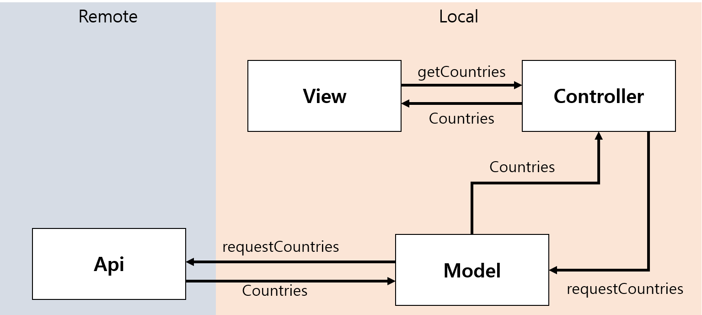
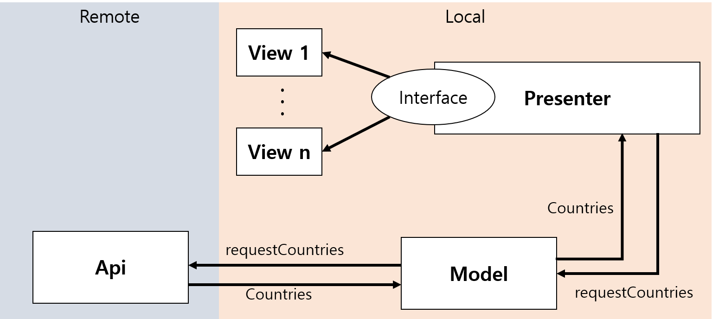

# [Pro Android: Modern Android Architectures - MVVM MVP MVC](https://www.udemy.com/androidarchitectures/)

---

### Progress

- Introduction
    - [x]  Introduction
    - [x]  Setting Foundation
    - [x]  App Structure
    - [x]  Building the MODEL
- MVC
    - [x]  Introduction to MVC
    - [x]  Building the VIEW
    - [x]  Building the CONTROLLER
- MVP
    - [x]  Introduction to MVP
    - [x]  Building the MVP architecture
- MVVM
    - [ ]  Introduction to MVVM
    - [ ]  Building the MVVM architecture
- Conclusion
    - [ ]  Conclusion

## MVC

---

- Clear Separation of **View** & **Controller**
    - test the **View** separately from **Controller**
    - 1 to 1 relationship —> cannot just swap new class

- Don't separate M, V, C first

    figure out functions needed & group those

- Evaluation

    View 수정시 Model 바꿔야 한다면 VIew 와 Model 사이의 연관관계가 존개 —> 잘못됨

## MVP

---

- Presenter : View = 1 : n
    - Presenter doesn't know which view get data or not
    - View just call method from Presenter

- View knows about the Presenter
    - Needs to instantiated, call method
    - When presenter calls View straight away to update interface when View is running
    Need to handle that information very specifically in the View —> MVVM

## MVVM

---